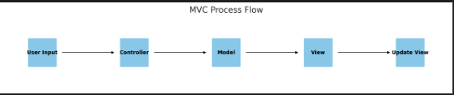
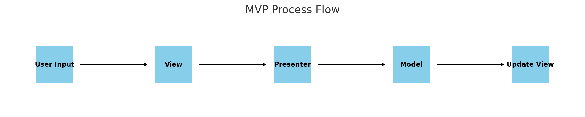
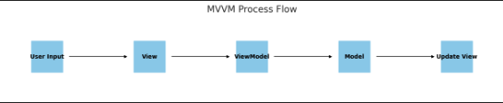

# Data 표현 방식
- XML  : eXtensible Markup Language
  - Tag based MarkUp Language 
  - 복잡한 데이터 구조 표현 가능
  - 태그 기반 구조로 인해 데이터 크기가 크고 구문이 복잡해질수있음
  - 비교적 느린편
  - 주로 문서 중심의 데이터 교환에 사용
  - ```XML
        <book>
        <title>XML Developer's Guide</title>
        <author>John Doe</author>
        <price>44.95</price>
        </book>
    ```
- YAML : YAML Aint Markup Language
  - Indentation 을 사용하여 데이터 구조를 표현
  - 다양한 타입 지원
  - 들여쓰기 오류 발생가능
  - 계층 구조 표현이 쉬움
  - 주로 설정 파일 형식으로 많이 사용(Kubernetes)
  - ```yaml
        book:
        title: YAML Developer's Guide
        author: John Doe
        price: 44.95
    ```
- JSON : JavaScript Object Notation
  - JS Object based
  - 대부분의 programming language 에서 파싱가능
  - 파싱 빠른편
  - 주석 지원 안함
  - 주로 웹 서버와 클라이언트 간의 데이터 교환 형식으로 사용
  - ```json
        {
          "book": {
            "title": "JSON Developer's Guide",
            "author": "John Doe",
            "price": 44.95
            }
        }
    ```
  
# Software Architecture
- MVC(Model-View-Controller)
  - Model : 데이터와 비즈니스 로직
  - View : User Interface
  - Controller : 입력 처리 & 모델 뷰 업데이트
  - 각 컴포넌트를 독립적으로 테스트 가능
  - 코드의 가독성와 유지보수성 높음
  - 대규모 애플리케이션에서 controller 가 복잡해질수 있음(Massive-View-Controller)
  - Model - View 간의 직접적 의존성 가능
  - Django(python/MTV),RubyonRails(Ruby),ASP.net,Spring(Java)
  - 동작 과정
    1. 사용자 입력: 사용자가 View(사용자 인터페이스)를 통해 애플리케이션과 상호작용합니다.
    2. Controller 처리: 입력된 사용자 요청이 Controller로 전달됩니다. Controller는 해당 요청을 해석하고 적절한 액션을 실행합니다.
    3. Model 업데이트: Controller는 Model을 업데이트하거나 데이터를 가져오는 등의 작업을 수행합니다.
    4. View 업데이트: Model의 변경 사항을 반영하여 View를 업데이트합니다.
    5. 결과 표시: 최종적으로 View는 업데이트된 데이터를 사용자에게 표시합니다.
  -  
   
- MVP(Model-View-Presenter)
  - Model: 데이터와 비즈니스 로직을 담당.
  - View: 사용자 인터페이스를 담당하며, Presenter의 지시에 따라 동작.
  - Presenter: Model과 View 사이의 상호작용을 관리.
  - View 와 Model 의 의존성이 낮음(View 가 Presenter 의 지시에 따라 동작해서)
  - View 가 수동적이라 Presenter 복잡해질수 있음
  - 같은 View에 여러  presenter 존재 가능
  - 동작과정
    1. 사용자 입력: 사용자가 View와 상호작용합니다.
    2. Presenter 처리: View는 사용자 입력을 Presenter에 전달합니다. Presenter는 해당 요청을 해석하고, Model을 업데이트하거나 데이터를 가져오는 작업을 수행합니다.
    3. Model 업데이트: Presenter는 Model을 업데이트하거나 데이터를 가져옵니다.
    4. View 업데이트: Presenter는 Model로부터 데이터를 받아 View를 업데이트합니다.
    5. 결과 표시: 최종적으로 View는 업데이트된 데이터를 사용자에게 표시합니다.
  - 
- MVVM(Model-View-ViewModel)
  - Model : 비즈니스 로직 & 데이터
  - View : 사용자 인터페이스 담당
  - ViewModel : View와 Model 을 연결하여 데이터 바인딩을 통해 View를 업데이트
  - UI 간단
  - View 와 Model 이 ViewModel을 통해 간접적으로 상호작용
  - Data 바인딩 로직이 복잡할수있음
  - 패턴을 이해하고 적용하기 생소할수 있음
  - 동작과정
    1. 사용자 입력: 사용자가 View와 상호작용합니다.
    2. ViewModel 처리: View는 데이터 바인딩을 통해 ViewModel과 연결되어 있습니다. ViewModel은 사용자 입력을 받아 Model을 업데이트하거나 데이터를 가져오는 작업을 수행합니다.
    3. Model 업데이트: ViewModel은 Model을 업데이트하거나 데이터를 가져옵니다.
    4. View 업데이트: ViewModel은 Model의 변경 사항을 반영하여 View를 업데이트합니다. 데이터 바인딩을 통해 자동으로 View가 갱신됩니다.
    5. 결과 표시: 최종적으로 View는 업데이트된 데이터를 사용자에게 표시합니다.
  - 